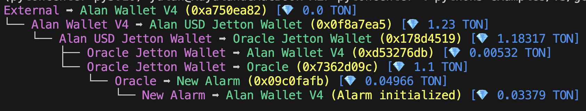

# Pytoncenter
[](https://codecov.io/gh/alan890104/pytoncenter)


## Introduction

Pytoncenter is a [TON Center](https://toncenter.com/) client with type hints that introduces advanced features such as **address subscriptions**, **obtaining transaction flows** similar to TON Viewer, **parallel processing of multiple calls**, and **robust debug tools**. Developers can use this package to create TON data analysis platforms, Dapp backends, and other services with enhanced functionality and efficiency.


## Features

Enhance your development workflow with Pytoncenter, offering:

1. **Rich Typing**: Elevate your coding experience with comprehensive typing for improved code clarity and error detection.
2. **Field Validation & Transformation**: Automate data integrity checks and format conversions supported by [Pydantic](https://docs.pydantic.dev/latest/), ensuring data accuracy effortlessly.
3. **TVM Data Format Conversion**: Seamlessly interact with TVM by automatically converting complex data structures like Addresses and Cells, based on C++ Python binding [Tonpy](https://tonpy.dton.io/)
4. **Concurrency & Rate Limiting**: Execute parallel requests smoothly while managing request rates efficiently to maintain optimal performance, thanks to the [aiolimiter](https://aiolimiter.readthedocs.io/en/latest/)
5. **Advanced Simplicity**: Access sophisticated functionalities like transaction subscriptions, message parsing, and method result decoding with ease and simplicity.
6. **V2 & V3 API Support**: Supporting both [V2](https://toncenter.com/api/v2/) and [V3](https://toncenter.com/api/v3/) APIs, Pytoncenter provides a comprehensive range of features for your development needs.

Simplify your development process with our feature-rich package designed for efficiency and ease of use.


## Quick Start

### 1. Install the package

To get started, install Pytoncenter using pip:

```bash
pip3 install pytoncenter
```

### 2. Export the TONCENTER_API_KEY

To use the TON Center API, you need to obtain an API key from the [TON Center](https://toncenter.com/). After obtaining the API key from [@tonapibot](https://t.me/tonapibot), export it as an environment variable:

```bash
export TONCENTER_API_KEY=your_api_key
```
<details>
<summary>Example 1. Get Account Info (API V3)</summary>

This example demonstrates how to obtain account information and jetton wallet balances using the TON Center API V3.

```python
from pytoncenter import get_client
from pytoncenter.v3.models import *
import asyncio


async def main():
    client = get_client(version="v3", network="testnet")
    my_address = "0QC8zFHM8LCMp9Xs--w3g9wmf7RwuDgJcQtV-oHZRSCqQXmw"
    account = await client.get_account(GetAccountRequest(address=my_address))
    jetton_wallets = await client.get_jetton_wallets(GetJettonWalletsRequest(owner_address=my_address, limit=10))
    masters = await client.multicall({w.address: client.get_jetton_masters(w.jetton) for w in jetton_wallets})
    print("=== Account Info ===")
    print(" -", "Symbol", "TON", "Balance:", account.balance / 1e9)
    print("=== Jetton Wallets ===")
    for wallet in jetton_wallets:
        jetton = masters.get(wallet.address, None)
        if jetton is None:
            continue
        content = jetton.jetton_content
        symbol = content.symbol if content else "unknown"
        decimals = (content.decimals if content else 0) or 9
        print(" -", "Symbol", symbol, "Balance", wallet.balance / 10**decimals)


if __name__ == "__main__":
    asyncio.run(main())
```
</details>

<details>
<summary>Example 2. Decode Get Method Result (API V3)</summary>

Here is an example for decoding get method by declaring the decoder and Type of the field explicitly. Decoder will decode the result based on the type of the field. If you are not sure about the type of the field, you can use AutoDecoder to decode the result.

```python
import asyncio
from pprint import pprint

from pytoncenter import get_client
from pytoncenter.decoder import AutoDecoder, JettonDataDecoder
from pytoncenter.v3.models import *


async def main():
    client = get_client(version="v3", network="testnet")
    req = GetAccountRequest(address="kQBqSpvo4S87mX9tjHaG4zhYZeORhVhMapBJpnMZ64jhrP-A")
    account_info = await client.get_account(req)

    # Check account status is active
    assert account_info.status == "active", "Account is not active"

    print("=====================================")

    req = RunGetMethodRequest(address="kQBqSpvo4S87mX9tjHaG4zhYZeORhVhMapBJpnMZ64jhrP-A", method="get_jetton_data", stack=[])
    result = await client.run_get_method(req)
    print(result)

    print("===============Jetton Decoder======================")
    decoder = JettonDataDecoder()
    jetton_data = decoder.decode(result)
    pprint(jetton_data, width=120)

    print("===============Auto Decoder======================")
    decoder = AutoDecoder()
    jetton_data = decoder.decode(result)
    pprint(jetton_data, width=120)


if __name__ == "__main__":
    asyncio.run(main())
```

You may get the following jetton data in the console:

```bash
OrderedDict([('total_supply', 5000000000),
             ('mintable', True),
             ('admin_address', EQC8zFHM8LCMp9Xs--w3g9wmf7RwuDgJcQtV-oHZRSCqQZ__),
             ('jetton_content', <CellSlice [9] bits, [1] refs, [A21FCFE4756B6AD7A1E88E65483CCDAB3BBBD9F8AEF5F5060C5FC8A36737AC36] hash>),
             ('jetton_wallet_code', 'b5ee9c7241022501000a......'),])
```

If you use AutoDecoder, you may get the following result:

```bash
OrderedDict([('idx_0', 5000000000),
             ('idx_1', -1), # Because auto decoder does not know the type, it will decode the result as number
             ('idx_2', EQC8zFHM8LCMp9Xs--w3g9wmf7RwuDgJcQtV-oHZRSCqQZ__), # Address field will automatically decode to Address object
             ('idx_3', 'b5ee9c7241022501000a......'), # Cell and Slice will apply b64decode to hex string
             ('idx_4', 'b5ee9c7241022501000a......'),])
```

However, for jetton data, there is a more efficient way to retreive the result by V3 API.

```python
client = get_client(version="v3", network="testnet")
jettons = await client.get_jetton_masters(GetJettonMastersRequest(address="kQBqSpvo4S87mX9tjHaG4zhYZeORhVhMapBJpnMZ64jhrP-A"))
jetton = jettons[0]
print("Total Supply: ", jetton.total_supply)
print("Mintable: ", jetton.mintable)
print("last transaction lt: ", jetton.last_transaction_lt)
if jetton.jetton_content is not None:
    print("Jetton content - Symbol: ", jetton.jetton_content.symbol)
    print("Jetton content - Name: ", jetton.jetton_content.name)
    print("Jetton content - Decimals: ", jetton.jetton_content.decimals)
    print("Jetton content - Image: ", jetton.jetton_content.image)
```

The output will be:

```bash
Total Supply:  5000000000
Mintable:  True
last transaction lt:  19051958000005
Jetton content - Symbol:  USDT
Jetton content - Name:  USDT
Jetton content - Decimals:  6
Jetton content - Image:  https://coinhere.io/wp-content/uploads/2020/08/Tether-USDT-icon-1.png
```
</details>

<details>
<summary>Example 3. Customization</summary>

```python
# you can customize the qps by passing the qps parameter, default is 9.5 if api key is provided, otherwise 1
client = get_client(version="v2", network="mainnet", qps=7.77)

# By default, the client will read the TONCENTER_API_KEY from the environment variable, you can pass the api_key parameter to customize the api key
client = get_client(version="v2", network="mainnet", api_key="you-api-key")

# By default, the client will use the default endpoint by network, you can pass the custom_endpoint parameter to customize the endpoint
client = get_client(version="v3", network="mainnet", qps=3.14, custom_endpoint="https://api.toncenter.com/v3")
```

</details>

<details>
<summary>Example 4. Get transaction trace</summary>

```python
import asyncio

from pytoncenter import get_client
from pytoncenter.v3.models import *
from pytoncenter.address import Address
from pytoncenter.utils import format_trace, create_address_mapping

"""
Take this transaction as example:
https://testnet.tonviewer.com/transaction/84b7c9467a0a24e7a59a5e224e9ef8803563621f4710fe8536ae7803fe245d61

The output transactions should be the whole trace of the transaction. The source transaction hash is
https://testnet.tonviewer.com/transaction/dc40feab455e86fa0736508febed224891c965ef6cbf55f5ec309247e8d38664
"""


async def main():
    client = get_client(version="v3", network="testnet")
    trace = await client.get_trace_alternative(GetTransactionTraceRequest(hash="84b7c9467a0a24e7a59a5e224e9ef8803563621f4710fe8536ae7803fe245d61", sort="asc"))
    addr_mapping = create_address_mapping(
        {
            Address("0QApdUMEOUuHnBo-RSdbikkZZ3qWItZLdXjyff9lN_eS5Zib"): "Alan Wallet V4",
            Address("kQCQ1B7B7-CrvxjsqgYT90s7weLV-IJB2w08DBslDdrIXucv"): "Alan USD Jetton Wallet",
            Address("kQDO_0Z0SuVpqpaNE0dPxUiFCNDpdR4ODW9KQAwgQGwc5wiB"): "Oracle Jetton Wallet",
            Address("kQCpk40ub48fvx89vSUjOTRy0vOEEZ4crOPPfLEvg88q1EeH"): "Oracle",
            Address("kQA0FY6YIacA0MgDlKN_qMQuXVZqL3qStyyaNkVB-svHQqsJ"): "New Alarm",
        }
    )
    output = format_trace(trace, address_mapping=addr_mapping)
    print(output)


if __name__ == "__main__":
    asyncio.run(main())

```

Sample output:



</details>

<details>
<summary>Example 5. Obtain Transaction trace (API V2)</summary>

The following example demonstrates how to obtain the transaction trace for a specified transaction. This transaction is associated with a contract deployed using the [TON Dynasty Contract Jetton Template](https://github.com/Ton-Dynasty/tondynasty-contracts/blob/main/contracts/jetton_example.tact).

- Contract Address on [Testnet TON Viewer](https://testnet.tonviewer.com/kQAreQ23eabjRO5glLCbhZ4KxQ9SOIjtw2eM2PuEXXhIZeh3)
- JettonMint Message Transaction on [Testnet TON Viewer](https://testnet.tonviewer.com/transaction/0f8d6b47a00d4914cb447b34cbce42e9e40c1d188e99ab76f56b0685b3532365)

```python
from pytoncenter import get_client
from pytoncenter.v2.tools import pretty_print_trace_tx, create_named_mapping_func
from pytoncenter.address import Address
import asyncio
import json

async def main():
    # Initialize the client and query a transaction
    client = get_client(version="v2", network="testnet")
    txs = await client.get_transactions(address="kQAreQ23eabjRO5glLCbhZ4KxQ9SOIjtw2eM2PuEXXhIZeh3", hash="Lomkyzxh1WBkxvxZ3cJNS2bAYIPC7dPZA67wDomGM4U=", limit=1)
    tx = txs[0]
    result = await client.trace_tx(tx)
    # Pretty print the transaction trace with name mapping for addresses
    named_func = create_named_mapping_func(
        {
            Address("EQC8zFHM8LCMp9Xs--w3g9wmf7RwuDgJcQtV-oHZRSCqQZ__"): "Alan WalletV4R2",
            Address("0:2b790db779a6e344ee6094b09b859e0ac50f523888edc3678cd8fb845d784865"): "Jetton Master",
            Address("kQC40ScRg9_1ob5sjWsdScltrCGu0HARsUnOYQ1esc12588C"): "Jetton Wallet",
        },
        truncate_address=True,
    )
    pretty_print_trace_tx(result, named_func=named_func)

if __name__ == "__main__":
    asyncio.run(main())
```

You may get the following output in the console:

```bash
Alan WalletV4R2 -> Jetton Master (Mint:1) [1.0 TON]
└── Jetton Master -> Jetton Wallet (0x178d4519) [0.955002 TON]
    └── Jetton Wallet -> Alan WalletV4R2 (0xd53276db) [0.853806 TON]
```
</details>

## Examples (V3)
1. [Get Transaction Traces](./examples/v3//get_tx_trace.py)
2. [Decode Jetton Get Method Result](./examples/v3/decode_jetton_data.py)
3. [Decode Custom Get Method Result](./examples/v3/decode_custom_data.py)
4. [Multicall](./examples/v3/multicall.py)
5. [Subscribe transactions for address](./examples/v3/subscribe_jetton_wallet.py)
6. [Get Account Balance](./examples/v3/get_account_balance.py)
7. [Get Previous Transaction](./examples/v3/get_prev_tx.py)
8. [Get Next Transaction](./examples//v3/get_next_tx.py)

## Examples (V2)
1. [Get Transaction Traces](./examples/v2/transaction_trace.py)
2. [Decode Jetton Get Method Result](./examples/v2/decode_jetton_data.py)
3. [Decode Custom Get Method Result](./examples/v2/decode_custom_data.py)
4. [Execute Parallelly](./examples/v2/multicall.py)
5. [Subscribe transactions for address](./examples/v2/subscribe_jetton_wallet.py)

## Examples (Address)
1. [Address Parser](./examples/v2/address.py)


## Development Guide

Please refer to the [Development Guide](./docs/dev.md) for more information on how to contribute to this project.
